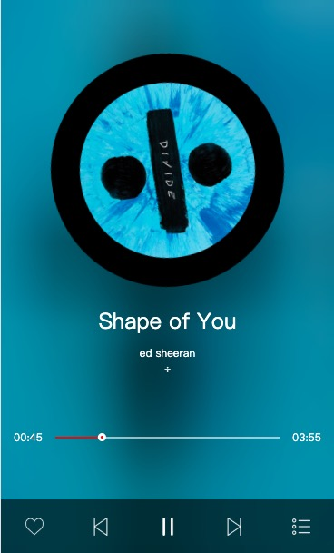
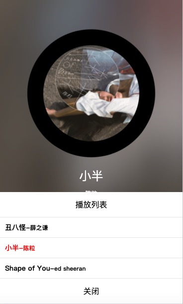
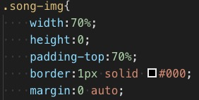
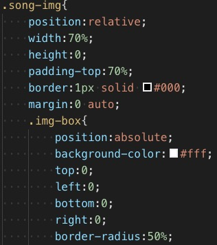

## 总结
### 项目预览
### 　　　　　　　　　主页

### 　　　　　　　　　切歌

### 　　　　　　　　　播放列表

### 项目描述:

 * less编写css样式
 * gulp进行文件打包，开启服务器监听，实现页面实时刷新处理，便于开发
 * ajax获取本地模拟数据
 * 模块化开发，将复用功能进行封装(高内聚)。在index.js全局下定义的len = data.length可在各个模块里直接用，无需传参(为防止命名冲突需改进为传参方式)
 * 本项目利用了两种暴露模块的方式(方便以后对具体项目进行具体选择）
 	* 暴露new Function();方便外部直接调用方法
 	* 直接暴露Function构造函数方便外部传参
 * 利用算法降低了indexControl.js里的代码耦合度
 * 利用css3属性解决setInterval设置动画出现跳帧现象，将时间与transition时间设置相等
 * 拖拽音频播放圆点到指定位置，将父元素作为拖拽区域，圆点点样式通过伪元素设置。**(为了避免点太小不方便快速的点中小点，以此增强用户体验)**
 * 设置进度条和圆点等位置需要精确匹配时，同时利用flex与absolute控制位置可使开发更为高效且位置更精准。
 * 利用requestAnimationFrame(frame);进行实时获取时间
 * 进度条处增加点击跳转功能 利用pointer-events:none;使得遮住
 的元素可以被透过。

### 心得:

1. 在网络环境不好时下载插件或是使用配置package.json然后通过npm install以及cnpm install方式加载插件时终端显示插件成功下载，但node_modules文件里会出现有些插件却找不到的情况。
2.	gulp升级4.0后导致['html','css','js']任务执行方式改变成了gulp.parallel('html','css','js')(并行执行)以及gulp.series(串行执行)两种方式
3. 开启服务器对两个页面进行监听时，需改一下connect.sever({})里的port让端口号不重复后再重新开启服务器 
4. 在开启自动监听实时更新页面内容时，发现gulp.watch只能进行一次监听。询问周围未果蒙着脑袋一通搜查发现可下载gulp-watch插件解决，并且此插件比gulp.watch更加强大，能监听文件改变、新增、删除。
5. 使用`$('.img-box img').attr('src', src);`修改标签属性值，动态的改变播放器圆盘的背景图片。使用`$('.like').addClass('liking')`修改class属性值。toggleClass修改
6. 对于利用js设修改标签属性动态改变样式有哪些方式？这些方式分别适合应用到什么样的场景？优缺点是什么(方便 or 性能 or 易于维护)？
7. 检测函数逻辑无误，功能却无法正常执行，也无报错时，特别注意函数调用的先后顺序

> 项目缺陷:进度条的圆点播放完后会被隐藏

## 拓展
### 高级方法设置自适应圆
根据父级宽高相等因此用[百分比]()设置:

里面的元素设置position后可以自动撑开

效果图：

